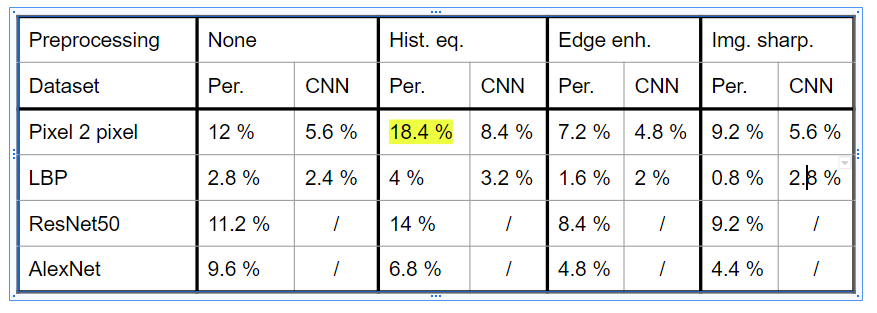
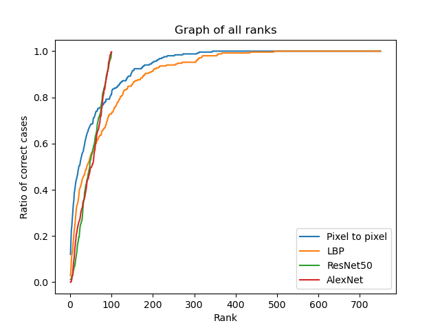

# IBB-Ear-Based-Identification
 
This is a code for ear based user identification  assignment, which was a part of Image based biometry course at Faculty of Computer and Information Science, University of Ljubljana.

The assignment was implemented on AWE dataset [[1]](#1) with perfectly cropped ear and also briefly tested on dataset that was obtained during the ear segmentation assignment [[3]](#3). I tested Pixel 2 pixel method, Local Binary Patterns (LBP) and two CNNs: ResNet50 and AlexNet. The starting point for my CNNs was [[2]](#2). I also used different image preprocessing techniques.

I obtained the following accuracies:

The rank curves on perfectly detected ears without preprocessing (except the required one for CNNs) are:

## References

<a id="1">[1]</a>
http://ears.fri.uni-lj.si/datasets.html#awe-full

<a id="2">[2]</a>
https://pytorch.org/tutorials/beginner/finetuning_torchvision_models_tutorial.html

<a id="3">[3]</a>
https://github.com/domenVres/IBB-Ear-Segmentation
